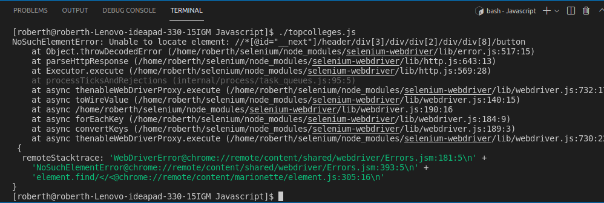

# Tests Scenario Zipia.com

For these tests we ran three scenarios:

## Scenario one

##### Test the site web https://www.zippia.com/project-manager-jobs/

#### <ol> Steps
##### <li> 1 Open the web site
##### <li> 2 Search web element "Compare Jobs" button.
##### <li> 3 Click on the web element "Compare Jobs" button.
##### <li> 4 Type a Word or Term you are looking for.
##### <li> 5 Press key Enter or Return to make the query.
##### <li> 6 View Results. 

## Scenario Two
##### Test the site web https://www.zippia.com/project-manager-jobs/

#### <ol> Steps
##### <li> 1 Open the web site
##### <li> 2 Search web element "List Top Colleges" button.
##### <li> 3 Click on the web element "Top Colleges" button.
##### <li> 4 Close the popup modal.
##### <li> 5 Search web element "View Full List" button.

## Scenario Three

##### Test the site web https://www.zippia.com/project-manager-jobs/salary/
#### <ol> Steps
##### <li> 1 Open the web site
##### <li> 2 Search web element "Location" button.
##### <li> 3 Click on the web element "Location" button.
##### <li> 4 Type a Word or Term you are looking for (for example: New York).
##### <li> 5 Search web element "Industry" button.
##### <li> 6 Click on the web element "Industry" button.
##### <li> 7 Click on the dropdown web element (for example: Technology).
##### <li> 8 Search web element "Education" button.
##### <li> 9 Click on the web element "Education" button.
##### <li> 7 Click on the dropdown web element (for example: Associate).

 

## These tests were done under the following environment:
### <li> ubuntu linux 20.04 operating system.
### <li> selenium-webdriver 4.0.0
### <li> nodejs version 14.17.6
### <li> geckodiver (driver for firefox browser)
 

### We made three executable files from the linux console, one for each test:

### to run each test you must type the following commands in the console:

### Test 1: ./demographics.js
### Test 2; ./topcolleges.js
### Test 3: ./salary.js

 

## Brief Conclusion: 

### The tests for Scnarios 1 and 3 were as expected. While in scenario 2, we encountered difficulties in closing the modal that appears when clicking on the web element.

### This modal could not be closed in the automated test, showing the error unable to locale the web elementfollowing error:

### We try serveral ways to make the test passed, but we could not.

### Finally we want to say thank you for give us the opportunitty to do this job. Thank you very much.

### Made by @Roberth Rondon

